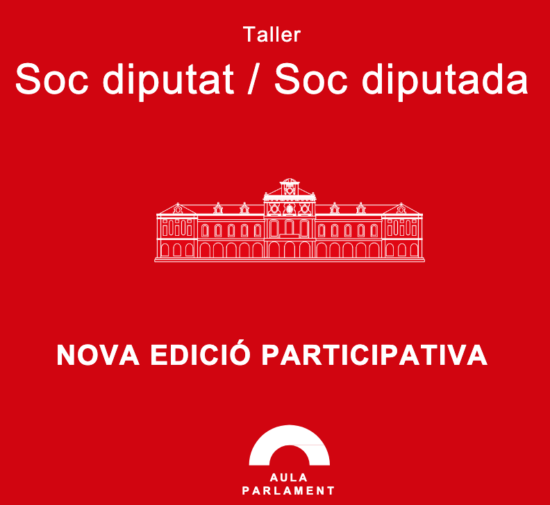

{fig-alt="diputat project"}

aPROPA't – Evaluation of Educational and Outreach Activities of the Parliament of Catalonia

The Parliament of Catalonia and the Universitat Pompeu Fabra have joined forces to evaluate the impact of the Parliament educational and outreach activities. In particular, the analysis focuses on the activity titled "I am a Deputy" (*Sóc diputat/Sóc diputada*).

This evaluation provides both quantitative and qualitative insights into the impact of the workshops, while also offering a tool to identify which activities have successfully achieved their goals and which have room for improvement. The project is also co-developed by [Verónica Moreno](https://www.linkedin.com/in/ver%C3%B3nica-moreno-oliver-phd-21a184141/?originalSubdomain=es) (Pedagogue in the Teaching Quality and Innovation Team -Engineering School and ICT Department, UPF.)

To know more about the activity, visit the wesbitse <https://www.parlament.cat/web/serveis-educatius/recursos-pedagogics/index.html>
