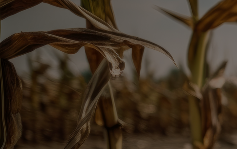
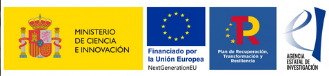

{fig-alt="attclimate project"}

The ATTCLIMATE project proposes a way to better understand people’s attitudes and behaviors regarding climate change and various policies to mitigate anthropogenic changes in the environment. Specifically, it has three research lines linked to the attitudes of citizens and political elites towards climate change and support for mitigation policies.

Visit our website <https://attclimate.net/en/>

{width="150"}
