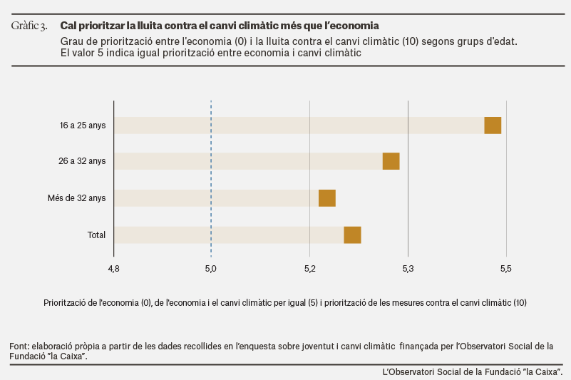
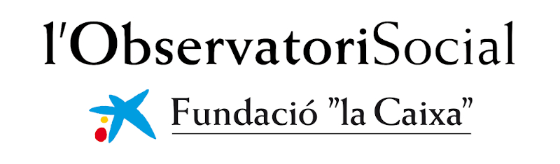

{fig-alt="caixa project"}

This research, funded by the Social Observatory-la Caixa Foundation and conducted in 2024, focused on understanding the attitudes of the Spanish public toward climate change, with a particular emphasis on the differences between young people and the rest of the population. The results, based on a survey of 5,000 individuals representative of the Spanish population, show that a large part of the population believes that climate change is mainly or exclusively the result of human activity—a view that is stronger among younger people. The survey also reveals that young people tend to be more concerned about climate change and usually give it more importance than to the economic situation. Finally, most young people consider that both they and older generations should make a similar effort to combat climate change, a position that contrasts with that of people over 32, who believe that it is precisely the young who should commit to making greater efforts.

See a summary of our findings in the article [Do attitudes towards climate change vary with age in Spain?](https://elobservatoriosocial.fundacionlacaixa.org/en/-/actituds-canvi-climatic-i-edat).

{width="140"}
