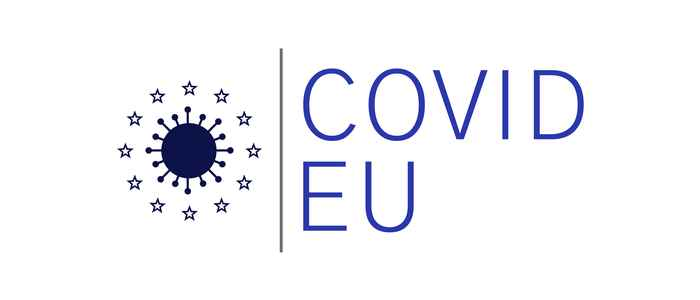

{fig-alt="covideu project"}

The COVIDEU Project studies the impact of the COVID-19 pandemic on support for the European Union.

The project, under the call "Challenges and Potentials for Europe: The Greying Continent", was launched in 2022 and it includes a multidisciplinary team of experts in the field of European studies. In addition to Toni Rodon, the other principal investigators are Heike Kluever (Humboldt University of Berlin, Germany), Sara Hobolt (London School of Economics and Political Science, UK) and Theresa Kuhn (University of Amsterdam, Netherlands), together with the economist Michal Krawczyk (University of Warsaw, Poland).

Visit our website <https://sites.google.com/view/covideuproject>

{width="140"}
