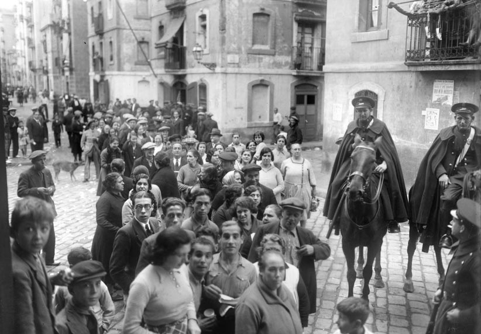
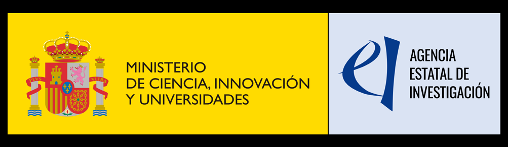

{fig-alt="vearlydem project"}

The VEARLYDEM project--Voting in Early Democracies: The Case of the Spanish Second Republic is funded by the Spanish Ministry of Science, Innovation and Universities. One of the goals of the project is to create a quantitative dataset detailing election result at the municipality level during the Spanish Second Republic, the first of its type, and a dataset on legislative speeches.

Stay tuned for more information.

{width="140"}
