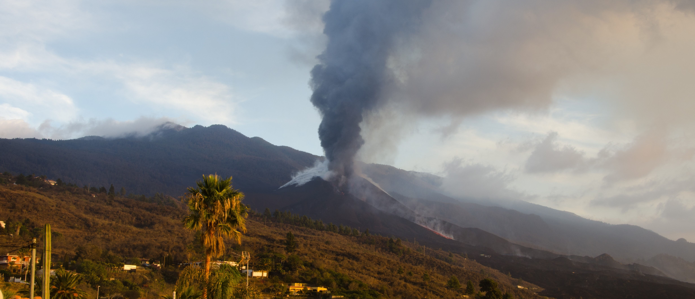

{fig-alt="attclimate project"}

The ATTCLIMATE project proposes a way to better understand people’s attitudes and behaviors regarding climate change and various policies to mitigate anthropogenic changes in the environment. Know more about the project in [Attclimate project](../../projects/attclimate/index.qmd) or visit our website <https://attclimate.net/en/>.

The first dataset of the project has most of the natural disastres that have taken place in the United States since 1953. You can see an interactive map at <https://attclimate.net/map.html>.

The second dataset will be a panel dataset conducted in Spain in several waves over the last four years. It will be published soon; stay tuned!

{width="150"}
