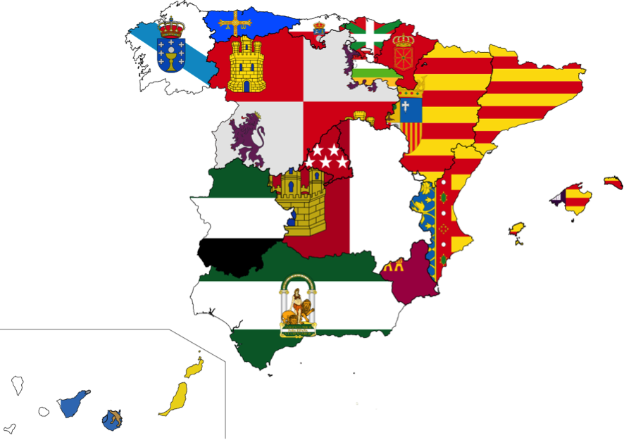

```{r}
library("distilltools")
library("htmltools")


abstract_box <- function(text, id=NULL) {
  # generate a unique id if not provided
  if (is.null(id)) id <- paste0("collapse_", as.integer(Sys.time()), "_", sample(1000:9999, 1))
  
  HTML(
    paste0(
      '<a class="btn" data-bs-toggle="collapse" href="#', id, 
      '" role="button" aria-expanded="false" aria-controls="', id, 
      '" style="color:#333; text-decoration:none; padding:4px 8px; border:1px solid #333; border-radius:4px; display:inline-block;">Abstract</a>
      <div class="collapse mt-1" id="', id, '">
        <div style="padding:0.5rem; font-size:0.95rem; white-space: normal; text-align: justify; color:#555;">',
      text,
      '</div>
      </div>'
    )
  )
}
```

{fig-alt="mapa"}

This dataset, compiled by Pau Vall-Prat, is based on region-cabinet observations for all regions (Comunidades Autónomas) in Spain between 1980s to 2015. The main variable of interest is the number of cabinet regional ministers and it is combined with other political, economic, and social indicators. The dataset was originally compiled for his BA Thesis (which I supervised). You can find the dataset here, and the replication materials here.

The complete dataset of this paper can be found in the Harvard Dataverse.

Vall-Prat, Pau; **Rodon, Toni** (2017) Decentralization and Regional Cabinet Size: the Spanish Case (1979-2015). *West European Politics*, 40(4): 717-740. `r icon_link(icon = "ai ai-doi", url = "https://doi.org/10.1080/01402382.2016.1275422")` `r icon_link(icon = "ai ai-archive", url = "https://www.dropbox.com/scl/fi/1697w3z6ccgr8103uogi7/WEP_regional_cabinet_size_replication_materials.zip?rlkey=jx3mumd0o62gxvktm73rr07op&e=1&dl=0")` `r abstract_box("This article explores under what conditions regional governments tend to have larger or smaller cabinets. The main contention is that cross-regional variation in cabinet size is partly explained by the dynamics set up by the multilevel system of government, mainly territorial decentralisation, multilevel government (in)congruence or the existence of nationally distinct regions. The hypotheses are tested with a new and original dataset built upon the Spanish case (1979–2015). Findings show that regions with more welfare state policies, especially when the region’s economic capacity is high, and nationally distinct regions tend to have bigger executives. In contrast, decentralisation in the form of basic state functions and government incongruence do not have a significant effect. Results have important implications for our understanding of sub-national territorial institutions and their interaction with decentralisation dynamics.")`

