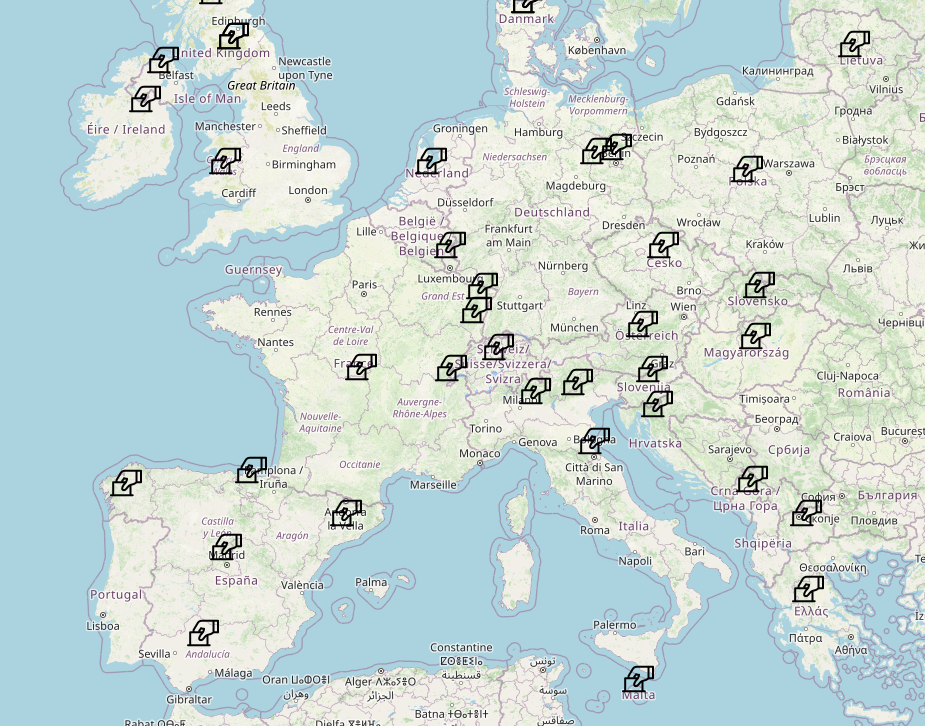

```{r}
library("distilltools")
library("htmltools")


abstract_box <- function(text, id=NULL) {
  # generate a unique id if not provided
  if (is.null(id)) id <- paste0("collapse_", as.integer(Sys.time()), "_", sample(1000:9999, 1))
  
  HTML(
    paste0(
      '<a class="btn" data-bs-toggle="collapse" href="#', id, 
      '" role="button" aria-expanded="false" aria-controls="', id, 
      '" style="color:#333; text-decoration:none; padding:4px 8px; border:1px solid #333; border-radius:4px; display:inline-block;">Abstract</a>
      <div class="collapse mt-1" id="', id, '">
        <div style="padding:0.5rem; font-size:0.95rem; white-space: normal; text-align: justify; color:#555;">',
      text,
      '</div>
      </div>'
    )
  )
}
```

{fig-alt="conrefweb"}

The CONREF dataset includes comprehensive information on sovereignty referendums. It details their type, the parties' share of the votes before and after the referendum and their policy position. 

You can also visit the project's website <https://conref.github.io/conref_website/>, which includes an interactive map.

**Rodon, Toni**; Guinjoan, Marc; Ioannidis, Nikandros (2025) Electoral and partisan consequences of sovereignty referendum outcomes: A comparative analysis, *Party Politics*. `r paste0(   icon_link(icon = "ai ai-doi", text = NULL, url = "https://doi.org/10.1177/13540688251320624", style="text-decoration:none; border:none; margin-right:8px; vertical-align:middle;"),   ' <a href="https://doi.org/10.34810/data2022" target="_blank" style="text-decoration:none;"></a>' )` `r abstract_box("What are the electoral consequences of winning a sovereignty referendum? While some argue that these referendums increase the electoral power of pro-sovereignty parties or even put in motion a slippery slope towards more (radical) demands, others sustain that sovereignty-related referendums are a “once in a generation” event, decrease the salience of territorial politics and hence the electoral appeal of pro-decentralisation parties. We put these narratives to the test using the newly compiled CONREF dataset, which includes comprehensive information on the type of sovereignty referendums, the party electoral outcomes before and after the referendum and their policy position. Our analysis shows no relationship between winning a sovereignty referendum and parties’ electoral fortunes. It also shows that referendums do not affect the territorial position of the parties–irrespective of the referendum outcome. If anything, we observe that the main party in the winner’s block loses support when the referendum passes for a small margin and that the opposition benefits when their side wins. In addition, looking at the EU referendums, we observe that when the position of anti-EU parties wins they become less Eurosceptic. Overall, our article improves our understanding of the dynamics of the winner-loser effects in sovereignty referendums and its spillovers to elections.")`

{width="140"}
