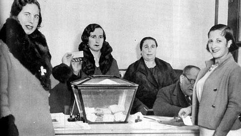

```{r}
library("distilltools")
library("htmltools")


abstract_box <- function(text, id=NULL) {
  # generate a unique id if not provided
  if (is.null(id)) id <- paste0("collapse_", as.integer(Sys.time()), "_", sample(1000:9999, 1))
  
  HTML(
    paste0(
      '<a class="btn" data-bs-toggle="collapse" href="#', id, 
      '" role="button" aria-expanded="false" aria-controls="', id, 
      '" style="color:#333; text-decoration:none; padding:4px 8px; border:1px solid #333; border-radius:4px; display:inline-block;">Abstract</a>
      <div class="collapse mt-1" id="', id, '">
        <div style="padding:0.5rem; font-size:0.95rem; white-space: normal; text-align: justify; color:#555;">',
      text,
      '</div>
      </div>'
    )
  )
}
```

{fig-alt="votdona"}

These dataset includes the first women who were selected to be poll officers in the province of Girona in the first elections after female enfranchisement in Spain. The data was collected from original archival sources (Official Gazettes and election tallies) and it was one of the main motivations for the paper Working for Democracy. 

The complete dataset of this paper can be found in the Harvard Dataverse.

Vall-Prat, Pau; **Rodon, Toni** (2025) Working For Democracy: Poll Officers and the Turnout Gender Gap. *British Journal of Political Science*, 55. `r paste0(   icon_link(     icon = "ai ai-doi",     text = NULL,     url = "https://doi.org/10.1017/S0007123424000280",     style="text-decoration:none; border:none; margin-right:12px; vertical-align:middle;"   ),   icon_link(     icon = "ai ai-dataverse",     text = NULL,     url = "https://doi.org/10.7910/DVN/WFSSWC",     style="text-decoration:none; border:none; margin-right:12px; vertical-align:middle;"   ) )` `r abstract_box("What factors contribute to closing the turnout gender gap after female enfranchisement? In the wake of franchise expansion, we test whether being a poll officer—and hence being exposed to election management—boosted the politicisation and mobilisation of women. In the context of the Spanish Second Republic (1931–1939), we exploit a lottery that assigned recently enfranchised women to be poll officers in the first election women were allowed to vote (1933). We use an original individual-level panel database and show that women randomly selected as polling officers were as likely to participate in subsequent elections than men, while the gender turnout gap persisted among the rest. Further analyses suggest that being poll officers made women more receptive to political organisations mobilisation strategies, and their presence had positive externalities by encouraging other women to participate. Our findings highlight the potential benefits of exposure to election engineering among groups previously excluded or less engaged with democracy.")`

-   <a href="https://effectivegov.uchicago.edu/podcast/is-this-the-most-unexpected-voter-turnout-strategy-ever" target="_blank" style="text-decoration:none;">  [Not another politics podcast]{style="color:#105064;"} </a>
-   <a href="https://rawcdn.githack.com/tonirc/polling_officers/refs/heads/main/female_english.html" target="_blank" style="text-decoration:none;">  [Interactive visualisation of the article]{style="color:purple;"} </a>

